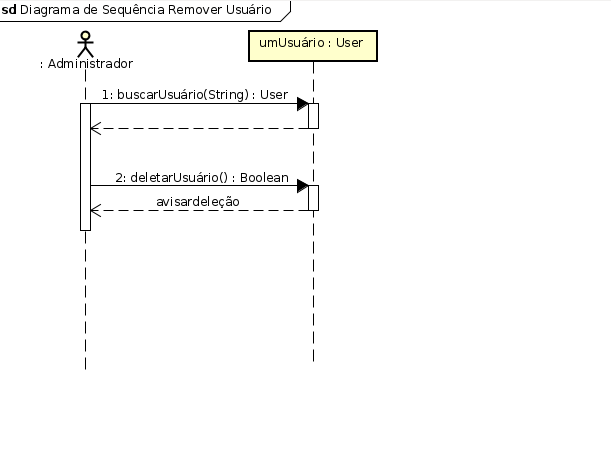
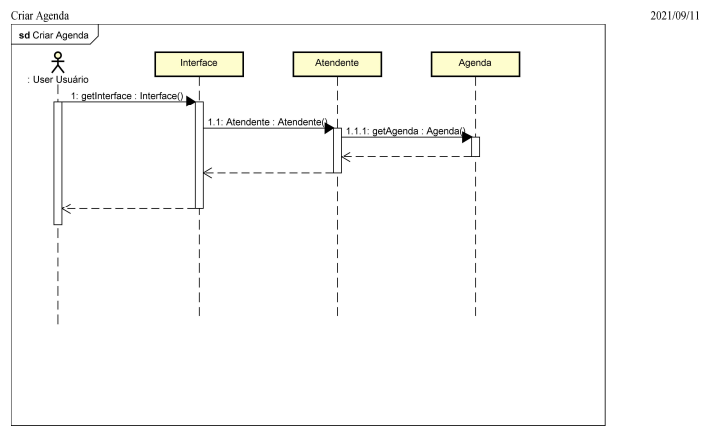
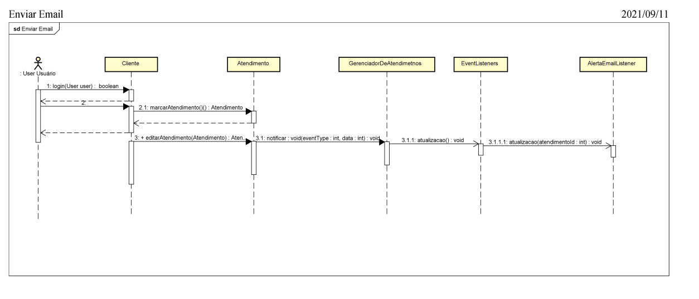

1. **CONCEPÇÃO**
1. **Nome do sistema** 
Agendando
2. **Motivação**

Necessidade de uma plataforma para agendar atendimentos.

3. **Objetivo**

Plataforma de marcação e gerenciamento de atendimento.

4. **Escopo**

**Descrição do MiniMundo**

O produto deste projeto é uma plataforma de agendamento de atendimento multiempresas, que a partir do cadastro do administrador, pode ser moldada ao tipo de negócio a que a empresa opera.

O objetivo principal deste produto é permitir o cadastramento de cada profissional de atendimento ao público em nome da empresa, que terá uma agenda associada ao mesmo para que os clientes usuários possam acessar a plataforma e escolher tanto o profissional de atendimento quanto o dia e horário, dentre os disponíveis na agenda do mesmo.

O resultado do atendimento será registrado na plataforma pelo profissional, mantendo assim um histórico de atendimento ao usuário, para futuras demandas, associadas ou não ao mesmo evento originário.

Os usuários ao se cadastrarem além de escolher profissional, data e horário de atendimento, também deverão fazer um breve relato da demanda a ser discutida ou atendida.

A plataforma também permitirá que o usuário faça uma avaliação ao atendimento que recebeu, de forma que o administrador possa avaliar o desempenho de sua equipe e promover melhorias de maneira que a qualidade de atendimento aos usuários seja sempre aprimorada.

Todos os profissionais e usuários que acessem a plataforma deverão estar cadastrados tendo sido escolhida como chave de acesso deles o número do CPF.

O sistema prevê a existência de um administrador, que será o responsável por eleger seus atendentes, dentre os funcionários cadastrados no sistema.

O administrador será responsável também pela criação e abertura da agenda mensal de todos os atendentes. Os atendentes deverão confirmar e liberar sua agenda, após validarem e marcarem as eventuais ausências já previstas, para evitar a exibição de horário que não estarão presentes para escolha dos usuários.

O usuário terá acesso a plataforma através da tela de login, sendo levado de imediato para tela de atendimento, no qual poderá consultar suas marcações futuras, agendar outras e avaliar os atendimentos já realizados.

2. **DOMÍNIO DO PROBLEMA**
1.1. **Atores do Sistema**

|Ator / Objeto / Serviço|Papel / Responsabilidade / Função|
| - | - |
|Administrador|Gerencia os usuários do sistema. Atribuição função de gerente para um usuário.|
|Atendente|Abre a sua agenda. Visualizar marcações na sua agenda. Gerência da própria agenda.|
|Cliente|Realiza marcação em um horário disponibilizado pelo atendente.|

1.2. **Glossário**

|Termo|Descrição|
| - | - |
|Usuário|Aquele que  registra na plataforma|
|Atendente|Figura a qual tem a permissão de ter e gerenciar sua agenda.|

**1. REQUISITOS**

1. Requisitos funcionais

|ID|Nome|Descrição|Referência|
| - | - | - | - |
|RFN01|Gerenciar Papéis de Usuário|O sistema deve conter meios para gerenciar diversos papéis..||
|RFN02|Marcar Atendimento|O sistema deve permitir que o cliente efetue a marcação de atendimentos.||
|RFN03|Listar Histórico do Atendimento|O sistema deve listar todo o histórico de agendamentos realizados pelo usuário.||
|RFN04|Listar Atendimentos|O sistema deve registrar e apresentar as datas agendadas pelo atendente.||
|RFN05|Efetuar Login|O usuário deverá se autenticar no sistema.||
|RFN06|Definir Tempo Padrão|O sistema deve ter um slot de tempo para agendamento.|8|
|RFN07|Cancelar Agendamento|O sistema deve permitir o cancelamento do agendamento.||
|RFN08|Emitir Protocolo|O sistema deve emitir um protocolo para cada agendamento.||
|RFN9|Deletar Usuário|O sistema deve permitir a deleção de um usuário.||
|RFN10|Enviar E-mail|O sistema deve enviar email ao usuário quando houver modificação de status.||
|RFN11|Registrar Feedback|O sistema deve permitir o registro do feedback do usuário após o atendimento.||
|RFN12|Gerar Relatório|O sistema deve gerar um relatório estatístico de número de atendimentos no período||
|RFN13|Cadastrar Usuário|O sistema deve permitir o cadastro de usuário||
|RFN14|Registrar Justificativa|O sistema deve permitir o registro de  uma justificativa para cancelar.||
|RF N15|Completar Perfil|O sistema deve permitir a inserção de dados no perfil dos usuários., como nome, atividade e descrição.||
|RFN16|Efetuar Busca|O sistema deve permitir a busca/filtragem de agendamentos.||
|RFN017|Cadastrar Atendente|O sistema deve ter uma tela para cadastro de atendentes .||
|RFN18|Cadastrar Administrador|O sistema deve permitir a criação do administrador.||
|RF N19|Solicitar Exclusão|O sistema deve permitir que o usuário solicite a exclusão da conta.||
|RFN20|Criar Notificações|O sistema deve permitir a criação de notificação na página inicial.||
|RFN21|Editar Notificações|O sistema deve permitir a edição das notificações da página inicial.||
|RFN22|Registrar Datas|O sistema deve registrar as datas/horário de não atendimento.||
|RFN 3|Criar Agenda|O sistema deve permitir a criação da agenda do mês.||
|RFN24|Identificar Atendente|Cada atendente da equipe que utilize o sistema deverá identificado pelo CPF.||
|RFN25|Alterar senha.|O sistema deve permitir a alteração de senha da conta.||
2. Requisitos não funcionais

|ID|Descrição|Classificação|
| - | - | - |
|RNF 1|O sistema deve respeitar as leis da LGPD.|Requisitos legais.|
|RNF 2|O sistema deve permitir que os usuários realizem as operações sem interrupções, isto é, todas as requisições devem transcorrer em tempo máximo de 1 minuto.|Requisitos de produtos|
|RNF 3|O sistema não apresentará aos usuários quaisquer dados de cunho privativo.|Requisitos éticos.|
|RNF 4|O sistema deve ser implementado com a persistência do sistema usando JDBC.|Requisitos de padrão|
|RNF 5|O padrão do código será definido pelo versionamento semântico (https://semver.org/lang/ pt-BR/).|Requisitos organizacionais:|
|RNF 6|O sistema deve ser acessado pelos seguintes navegadores web: Opera, Google Chrome.|Requisitos de portabilidade..|
|RNF 7|A versão do sistema somente será disponível para aplicações web em desktop, não sendo suportada versão mobile.|Requisitos de produtos|
|RNF 8|Os horários informados no sistema devem corresponder com o horário oficial do Brasil , o qual é de Brasília.|Requisitos externos|
|RNF 9|O sistema deverá ter disponibilidade dentre os horários 08:00 às 20:00.|Requisitos de confiabilidade|
|RNF 10|Os usuários não precisarão de treinamento para realizar a operação  no sistema.|Requisitos de usabilidade|
|RNF 11|As informações exibidas no sistema serão sempre na língua portuguesa.|Requisitos de produtos|
|RNF 12|O código do sistema será arquivado no Github.|Requisitos organizacionais.|
|RNF 13|O sistema não deve ultrapassar 3GB de tamanho |Requisito de implementação|
|RNF 14|Para o desenvolvimento dos códigos será adotado o git flow para a gerência de manutenção de código.|Requisitos organizacionais.|
|RNF 15|O tamanho do código executável do sistema não deve requerer mais do que 16GB de RAM|Requisito de implementação|

4. **CASOS DE USO**
4.1. Descrição dos casos de uso

|Nome|**RFN01 - Gerenciar Papéis de Usuário**|
| - | - |
|Ator(es)|Administrador|
|Descrição|O Administrador altera o papel de um usuário do sistema para cliente, administrador ou atendente,|
|Referências||
|Gatilho||
|Pré-condições|O usuário que vai ser alterado estar cadastrado no sistema|
|Pós-condições|O papel do usuário deve ser atualizado conforme o novo escolhido|
|Fluxo principal (cenário típico)|1 - O administrador entra no sistema tendo feito seu login 2 - O administrador vai na tela de gerência de usuários.3 - O administrador escolhe o usuário e altera o seu perfil. 4 - O papel do usuário é alterado.|
|Fluxo alternativo (cenário alternativo)| 2.1 - O usuário procurado não é encontrado.2.1.1 - O Administrador escolhe outro usuário.2.1.2 - Volta ao passo 3.|

|Nome|**RFN02Marcar Atendimento**|
| - | - |
|Ator(es)|Cliente|
|Descrição|O usuário faz a marcação|
|Referências||
|Gatilho||
|Pré-condições|Ter feito um login no sistema|
|Pós-condições|tornar o horário solicitado indisponível no sistema|
|Fluxo principal (cenário típico)|1 - Cliente entra no sistema tendo feito seu login2 - Cliente seleciona o profissional e sua respectiva agenda3 - Cliente analisa os horários disponíveis na agenda e escolhe um 4 - O cliente recebe um protocolo após confirmar sua marcação|
|Fluxo alternativo (cenário alternativo)|2.1 - Profissional procurado não se encontra na lista.2.1.1 - Cliente seleciona outro profissional2.1.1.1 - Cliente retorna ao passo 32.1.2 - Cliente sai do sistema3.1 - Não há horário compatível na lista de disponibilidade3.1.1 - Cliente volta ao passo 2 e seleciona outro profissional3.1.2 - Cliente sai do sistema|

|Nome|**RFN03Listar Histórico do Atendimento**|
| - | - |
|Ator(es)|Cliente ou Atendente|
|Descrição|Um usuário acessa o histórico da alteração dos dados de um atendimento.|
|Referências||
|Gatilho|**RFN02Marcar Atendimento**|
|Pré-condições|O atendimento já deve ter sido marcado.|
|Pós-condições||
|Fluxo principal (cenário típico)|1 - O cliente acessa a tela de atendimento.2 - O cliente escolhe um atendimento que deseja ver seu histórico e clica no mesmo.3 - O cliente visualiza o histórico do atendimento selecionado.|
|Fluxo alternativo (cenário alternativo)|1 - O atendente acessa a tela de atendimento.2 - O atendente escolhe um atendimento que deseja ver seu histórico e clica no mesmo.3 - O atendente visualiza o histórico do atendimento selecionado.|

|Nome|**RFN04Listar Atendimentos**|
| - | - |
|Ator(es)|Atendente|
|Descrição|O cliente visualiza as datas agendadas registradas.|
|Referências||
|Gatilho|**RFN22Registrar Datas ; RFN 23 Criar Agenda**|
|Pré-condições|O administrador deve já ter criado a agenda do mês e o atendente deve ter registrado já as datas o qual estará disponível.|
|Pós-condições||
|Fluxo principal (cenário típico)|1 - O atendente acessa a tela de seus atendimentos.2 - O atendente escolhe e visualiza os dados do atendimento.|
|Fluxo alternativo (cenário alternativo)||

|Nome|**RFN05Efetuar Login**|
| - | - |
|Ator(es)|Usuário, Atendente, Administrador|
|Descrição|Os usuários cadastrados no sistema vão realizar a autenticação no sistema.|
|Referências||
|Gatilho||
|Pré-condições|O usuário deve ter uma conta registrada no sistema.|
|Pós-condições|Ao logar o usuário deve ser redirecionado para tela inicial com as opções correspondentes ao seu papel de usuário.|
|Fluxo principal (cenário típico)|1 - O usuário acessa a tela de login.2 - O usuário preenche o seu CPF e a senha nos campos correspondentes.3 - O usuário clica no botão de Efetuar Login.4 - O usuário realiza a autenticação.|
|Fluxo alternativo (cenário alternativo)|2.1 - O usuário digita o CPF incorreto.2.1.1 - O sistema informa que não existe CPF cadastrado.2.1.2 O usuário digita o CPF correto.2.2 Volta o passo 3.2.1 - O usuário digita a senha incorreta.2.1.1 - O sistema informa que a senha está incorreta.2.1.2 O usuário digita a senha  correta.2.2 Volta o passo 3.|

|Nome|**RFN06 Definir Tempo Padrão**|
| - | - |
|Ator(es)|Administrador|
|Descrição|O administrador cadastra o paramento dias da semana e horário de funcionamento, intervalo de almoço e cadastra também o tempo padrão de atendimento de cada cliente.|
|Referências||
|Gatilho||
|Pré-condições||
|Pós-condições|Geração da agenda do mês|
|Fluxo principal (cenário típico)|O administrador acessa a plataforma e define o tempo de slot padrão para os atendimentos|
|Fluxo alternativo (cenário alternativo)||

|Nome|**RFN07Cancelar Agendamento**|
| - | - |
|Ator(es)|Cliente|
|Descrição|O usuário cancelar uma marcação|
|Referências||
|Gatilho||
|Pré-condições|Ter feito um login no sistema e possuir um protocolo de agendamento|
|Pós-condições|tornar o horário solicitado disponível no sistema|
|Fluxo principal (cenário típico)|1 - Cliente entra no sistema tendo feito seu login2 - Cliente seleciona a opção *CANCELAR AGENDAMENTO* 3 - Cliente digita o protocolo de agendamento a ser cancelado 4 - O cliente confirma o cancelamento da marcação na tela5 - O cliente recebe a mensagem de *CANCELAMENTO COM SUCESSO*|
|Fluxo alternativo (cenário alternativo)|3.1 - Sistema não encontra o protocolo digitado3.1.1 - Cliente volta ao passo 3 e faz nova digitação3.1.1.1 - Cliente vai para o passao 43.1.1.2 - Cliente volta para o passo 3.1.1|

|Nome|**RFN08Emitir Protocolo**|
| - | - |
|Ator(es)|Sistema|
|Descrição|Quando um atendimento é criado deve ser gerado um protocolo atrelado.|
|Referências||
|Gatilho|**RFN02Marcar Atendimento**|
|Pré-condições||
|Pós-condições|O cliente deve poder visualizar o protocolo.|
|Fluxo principal (cenário típico)|Após a marcação do atendimento o protocolo é criado.|
|Fluxo alternativo (cenário alternativo)|Não se aplica.|

|Nome|**RFN09 Deletar Usuário**|
| - | - |
|Ator(es)|Administrador|
|Descrição|O administrador acessar o painel de usuário e deletar um usuário|
|Referências||
|Gatilho|Não se aplica.|
|Pré-condições|O administrador deve estar logado na plataforma.|
|Pós-condições|O usuário deletado não deve ter mais acesso ao sistema.|
|Fluxo principal (cenário típico)|1 - O administrador acessa o painel de usuários.2 - O administrador escolhe um usuário.3- O administrador clica no botão de deletar.4 - No pop-up de confirmação o administrador clica em deletar. 5 - O administrador deve visualizar a tela de usuários sem o usuário.|
|Fluxo alternativo (cenário alternativo)|2. O administrador clica no botão de deletar.2.1 No pop-up de confirmação o administrador clica em cancelar.&emsp;2.2 O administrador volta para tela de usuários|

|Nome|**RFN10 Enviar E-mail**|
| - | - |
|Ator(es)|Atendente ou Cliente|
|Descrição|Quando o status do atendimento for alterado|
|Referências|Não se aplica.|
|Gatilho|Qualquer alteração no status do cadastro.|
|Pré-condições|O atendimento deve ser marcado.|
|Pós-condições|As informações devem bater|
|Fluxo principal (cenário típico)|1- O atendente altera uma informação do atendimento. 2- O atendente salva as alterações.3- O sistema retorna o e-mail para o usuário.|
|Fluxo alternativo (cenário alternativo)|1- O usuário altera uma informação do atendimento. 2- O usuário salva as alterações.3- O sistema retorna o e-mail para o usuário.|

|Nome|**RFN11 Registrar Feedback**|
| - | - |
|Ator(es)|Cliente|
|Descrição|O usuário registra um feedback sobre o atendimento recebido|
|Referências||
|Gatilho|Não se aplica.|
|Pré-condições|O atendimento deve ser concluído com sucesso|
|Pós-condições|O feedback será armazenado|
|Fluxo principal (cenário típico)|1- O usuário abre o componente para avaliação. 2 - O usuário marca a opção desejada.3- O usuário salva a avaliação.|
|Fluxo alternativo (cenário alternativo)|Não se aplica.|

|Nome|**RFN12 Gerar Relatório**|
| - | - |
|Ator(es)|Administrador|
|Descrição|O administrador gera um relatório de acordo com a área de interesse.|
|Referências|Não se aplica.|
|Gatilho||
|Pré-condições||
|Pós-condições||
|Fluxo principal (cenário típico)|1- O administrador abre a tela de relatório.2- Seleciona a opção de relatório: usuários, atendimento, atendente.3- O administrador clica em exportar.4- É realizado o download do arquivo.|
|Fluxo alternativo (cenário alternativo)|Não se aplica.|

|Nome|**RFN13 Cadastrar Usuário**|
| - | - |
|Ator(es)|Cliente|
|Descrição|O cliente realiza o cadastro na plataforma|
|Referências|Não se aplica.|
|Gatilho|Não se aplica.|
|Pré-condições|Não se aplica.|
|Pós-condições|Cadastrar o usuário na plataforma.|
|Fluxo principal (cenário típico)|1 - O usuário acessa o sistema.2 - O usuário preenche  o formulário e os seus dados corretamente.3 - O usuário clica no botão cadastrar.|
|Fluxo alternativo (cenário alternativo)|2 - O usuário preenche os dados incorretamente.2.1 - O sistema informa o usuário.2.2 - O usuário volta para o passo 2 inicial.|

|Nome|**RFN14 Registrar Justificativa**|
| - | - |
|Ator(es)|Cliente|
|Descrição|O usuário registra uma justificativa para o cancelamento de seu atendimento.|
|Referências||
|Gatilho|**RFN07Cancelar Agendamento**|
|Pré-condições|O cancelamento do agendamento deve ter sido realizado com sucesso.|
|Pós-condições|A justificativa é registrada. O e-mail é enviado para o usuário com- aviso.|
|Fluxo principal (cenário típico)|1 - O atendente acessa a tela do agendamento. 2 - O atendente insere a justificativa e a salva.|
|Fluxo alternativo (cenário alternativo)|Não se aplica.|

|Nome|**RFN15 Completar Perfil**|
| - | - |
|Ator(es)|Atendente ou Cliente|
|Descrição|Inserção de dados no perfil dos usuários, como nome, atividade e descrição.|
|Referências|Não se aplica.|
|Gatilho||
|Pré-condições|Ter um cadastro na plataforma.|
|Pós-condições|As alterações feitas no perfil refletirem na página.|
|Fluxo principal (cenário típico)|1 - O usuário entrar no seu perfil.2 - O usuário alterar os dados dos campos como: como nome, atividade e descrição.3- O usuário salvar as alterações.|
|Fluxo alternativo (cenário alternativo)|2.1 - O usuário após realizar as alterações clicar no botão de cancelar.|

|Nome|**RFN16 Efetuar Busca**|
| - | - |
|Ator(es)|Administrador|
|Descrição|O administrador realizará a busca/filtragem de agendamentos.|
|Referências|Não se aplica|
|Gatilho|Não se aplica|
|Pré-condições|Não se aplica|
|Pós-condições|Não se aplica|
|Fluxo principal (cenário típico)|1 - O administrador acessa a tela de listagem dos agendamentos. 2 - O administrador realiza uma busca com um agendamento cujos dados existem.3- O agendamento é exibido na tela.|
|Fluxo alternativo (cenário alternativo)|2.1 - O administrador realiza uma busca com um agendamento cujos dados não existem.2.2 O administrador faz uma nova busca.|

|Nome|**RFN17 Cadastrar Atendente**|
| - | - |
|Ator(es)|Administrador|
|Descrição|O administrador cadastrar um atendente|
|Referências|Não se aplica.|
|Gatilho|Não se aplica.|
|Pré-condições|Não se aplica.|
|Pós-condições|Não se aplica.|
|Fluxo principal (cenário típico)|1 - O administrador entra na tela de cadastro de atendente, 2 - O administrador preenche os dados e clica em salvar.|
|Fluxo alternativo (cenário alternativo)|Não se aplica.|

|Nome|**RFN18 Cadastrar Administrador**|
| - | - |
|Ator(es)|Administrador|
|Descrição|Cadastrar o administrador do sistema de agendamento, com todas as informações exigidas na tela de cadastro, exceto sua qualificação (status) que será inserido pelo processo.|
|Referências||
|Gatilho||
|Pré-condições|Nenhum usuário pode estar cadastrado no sistema e o ator deve estar logado com os dados de inicialização do sistema:CPF 111111111-11 e senha 222222|
|Pós-condições|Administrador cadastrado e sistema liberado para cadastro das agendas e atendentes.|
|Fluxo principal (cenário típico)|1. O caso de uso começa quando o ator seleciona a opção cadastrar Administrador na tela principal do sistema. O sistema apresenta a tela de cadastro de usuário com os seguintes campos em branco: “CPF”, “nome”, "email", “senha”, “data de nascimento”.2. O ator preenche os campos obrigatórios e clica no botão CADASTRAR.3. O sistema processa os dados e mostra a mensagem de sucesso da operação na tela de cadastro.|
|Fluxo alternativo (cenário alternativo)||

|Nome|**RFN19 - Solicitar exclusão**|
| - | - |
|Ator(es)|Usuário|
|Descrição|O usuário deseja solicitar a exclusão de sua conta do sistema|
|Referências||
|Gatilho|Não se aplica|
|Pré-condições|Ter uma conta ativa e estar logado no sistema|
|Pós-condições|Requisição de exclusão de conta enviada para o administrador do sistema|
|Fluxo principal (cenário típico)|1. O usuário acessa o seu perfil2. Escolhe a opção de excluir sua conta3. Um pop-up pedindo a confirmação da ação é aberto4. Seleciona a opção de aceitar5. Mensagem que a solicitação foi enviada ao administrador|
|Fluxo alternativo (cenário alternativo)|4 - Usuário clicou enganado no botão para excluir a conta4.1 - Seleciona a opção negativa no pop-up|

|Nome|**RFN20 - Criar Notificação**|
| - | - |
|Ator(es)|Administrador|
|Descrição|Cadastrar notificação a ser exibida na tela principal do sistema de forma a fornecer informações orientadoras aos usuários do sistema.|
|Referências||
|Gatilho||
|Pré-condições|O administrador já estar cadastrado - **RFN18 Cadastrar Administrador**|
|Pós-condições|Permitirá que o usuário tenha acesso a informações importantes no acesso à home do sistema,|
|Fluxo principal (cenário típico)|1. O caso de uso começa quando o ator seleciona a opção cadastrar Notificação na tela principal do sistema. O sistema apresenta a tela de cadastro de notificação com o campo de texto em branco e o campo de data limite para preenchimento obrigatório.2. O ator preenche os campos obrigatórios e clica no botão CADASTRAR.3. O sistema processa os dados e mostra a mensagem de sucesso da operação na tela de cadastro.|
|Fluxo alternativo (cenário alternativo)|Caso a notificação já exista ou a data informada seja anterior à data corrente, o sistema retorna uma mensagem informando o erro encontrado.|

|Nome|**RFN21 Editar Notificações**|
| - | - |
|Ator(es)|Administrador|
|Descrição|O administrador editar as notificações da página inicial.|
|Referências|Não se aplica.|
|Gatilho|Não se aplica.|
|Pré-condições|Ter uma nota criada.|
|Pós-condições|As alterações feitas nas notificações refletirem na página inicial.|
|Fluxo principal (cenário típico)|1 - O administrador seleciona a notificação.2 - O administrador altera o texto presente na nota. 3-  O administrador salva a notificação.|
|Fluxo alternativo (cenário alternativo)|Não se aplica.|

|Nome|**RFN22 Registrar Datas**|
| - | - |
|Ator(es)|Atendente|
|Descrição|O atendente precisa conseguir registrar as datas que serão disponibilizadas para marcação|
|Referências||
|Gatilho||
|Pré-condições|Existir uma agenda|
|Pós-condições|A agenda será criada|
|Fluxo principal (cenário típico)|1 - O atendente logado no sistema acessa sua agenda2 - O atendente cria um novo slot de tempo na sua agenda|
|Fluxo alternativo (cenário alternativo)|1.1 - Agenda nao encontrada|

|Nome|**RFN23 Criar Agenda**|
| - | - |
|Ator(es)|Atendente|
|Descrição|O atendente precisa ter uma agenda para disponibilizar horários para atendimento|
|Referências||
|Gatilho||
|Pré-condições|O usuario ser um atendente|
|Pós-condições|A agenda é criada|
|Fluxo principal (cenário típico)|1 - O atendente logado no sistema cria uma agenda 2 - Agenda criada|
|Fluxo alternativo (cenário alternativo)|1.1 - O usuário já possui uma agenda|

|Nome|**RFN24 - Identificar Atendente**|
| - | - |
|Ator(es)|Atendente|
|Descrição|O atendente deverá ser reconhecido no sistema pelo seu CPF.|
|Referências||
|Gatilho|RFN5|
|Pré-condições|Usuário deve ser um atendente e sua equipe deve estar cadastrada no sistema|
|Pós-condições|Atendente identificado|
|Fluxo principal (cenário típico)|1. Login no sistema com CPF de atendente2. O sistema identifica a equipe em que o atendente está cadastrado|
|Fluxo alternativo (cenário alternativo)|1 - O CPF não está cadastrado como atendente1.1 - O usuário é autenticado como cliente2 - O atendente não está cadastrado em uma equipe2.1 - Mensagem de erro informando que não está cadastrado emnenhuma equipe ativa|

|Nome|**RFN25 Alterar Senha**|
| - | - |
|Ator(es)|Usuário, Atendente, Administrador, Cliente.|
|Descrição|O usuário deseja solicitar a alteração da senha relativa à sua conta.|
|Referências||
|Gatilho||
|Pré-condições|O usuário deve estar logado no sistema.|
|Pós-condições|A senha do usuário foi alterada.|
|Fluxo principal (cenário típico)|1 - O usuário entra no seu perfil.2 - O usuário seleciona as opções de privacidade. 3 - O usuário seleciona a opção de alterar a senha. 4 - O usuário insere a senha anterior.5 - O usuário insere a nova senha.6 - O usuário confirma a nova senha.7 - O usuário confirma as alterações.|
|Fluxo alternativo (cenário alternativo)|4 - A senha está incorreta4.1 - Mensagem indicando que a senha anterior foi digitadaincorretamente.5 - A senha é igual a anterior.5.1 - Mensagem indicando que a senha não pode ser igual aanterior6 - As senhas não correspondem.6.1 - Mensagem indicando que a senha digitada no passo 5 nãocorresponde com a senha digitada no passo 6.7.1 - Após realizar as alterações, o usuário clica no botão de cancelar.|
1. **Diagrama casos de uso**

5. **ARQUITETURA DO SISTEMA**
1. **Diagrama de Arquitetura**: Imagem em anexo.

2. Arquitetura:

Decidimos uma arquitetura em camadas, visto que cada camada será responsável por um serviço e a camada fornece serviços à camada acima dela. Outro ponto é pela facilidade em criar recursos novos em cima do sistema permitindo o desenvolvimento espalhado pelo grupo.

3. Padrão de Projeto:

O principal padrão de projeto escolhido foi o padrão, MVC, (Model-View-Controller). Tal padrão permite a divisão do projeto em camadas bem definidas, as quais são, o Model (responsável gerenciar o modelo de dados), o Controller (interpreta e mapeia as ações do usuário), e a View (seu papel será de receber as instruções do Controller e do Model para exibir os dados ao usuário em uma interface). Logo, tal padrão facilitará a  divisão das atividades entre o grupo.

6. **DIAGRAMA DE CLASSES**

7. **DIAGRAMA DE SEQUENCIA**

